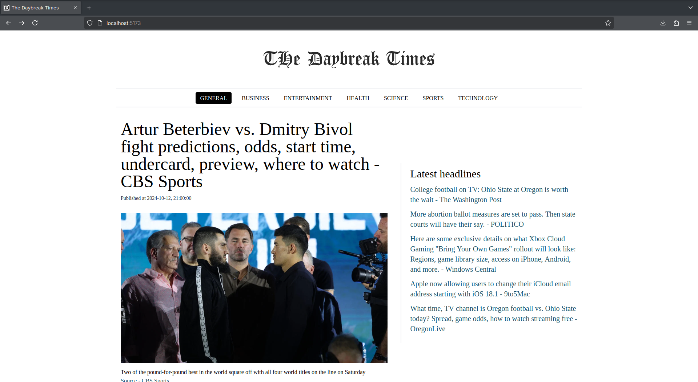
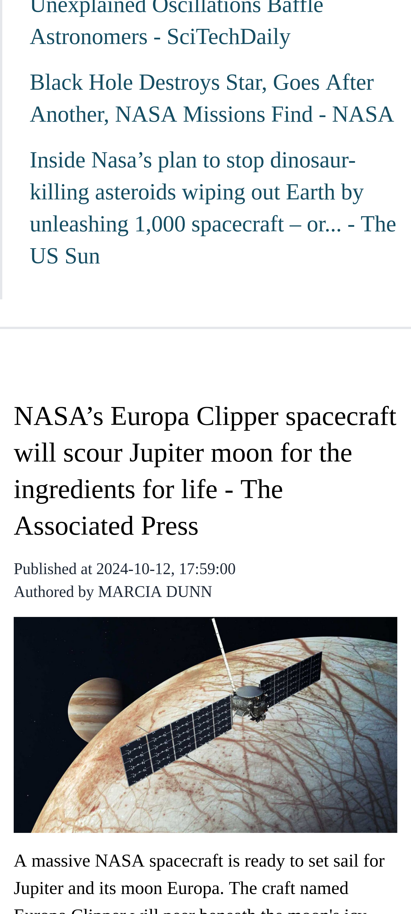

# Sample news website

Built using [newsapi.org's](https://newsapi.org) API, using
[React](https://react.dev) and [TailwindCSS](https://tailwindcss.com).

## Build instructions

Note: Build requires a recent version of Node.js

1. Clone the repository

```bash
git clone https://github.com/nikhilmwarrier/react-news-api-demo
```

2. Install dependencies

```bash
cd react-news-api-demo && npm i
```

3. Set the API key in the appropriate environment variable

```
echo VITE_NEWSAPI_KEY=XXXXXXXXXXXXXXX >> .env
```

3. Build

```bash
npm run build
```

4. Run the preview server

```bash
npm run preview
```

## Screenshots

### Desktop



### Mobile


